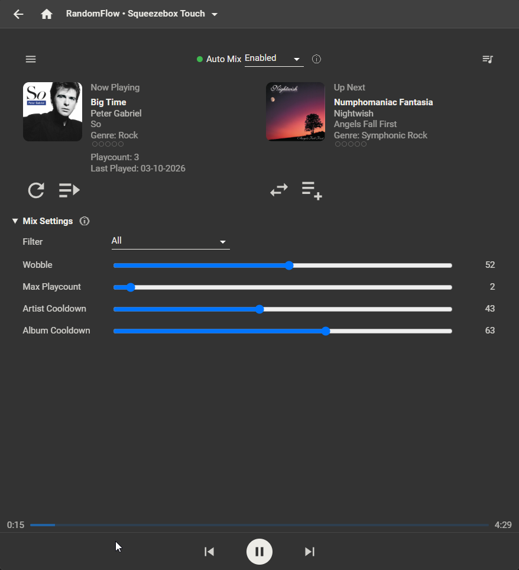
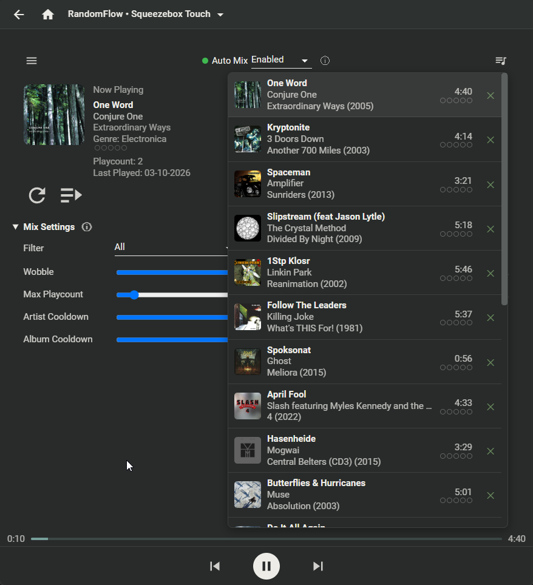

# Random Flow - Usage Guide

This guide covers the Live page - Random Flow's real-time web UI - which is where you'll spend most of your time day to day. For installation, see [README.md](README.md).

## Opening the Live page

From the Lyrion/Material web interface, open **RandomFlow** from the Extras menu (same menu that lists other players/apps). This opens the Live page for the currently selected player.

## Auto Mix

The green/red dot and the **Auto Mix** dropdown at the top show and control whether Random Flow is actively sustaining a mix for this player. With Auto Mix **Enabled**, Random Flow keeps the queue topped up automatically as you listen. With it **Disabled**, Random Flow does nothing for this player - **Start New Mix**, **Start Batch**, **Replace Track** and the Extras menu's **Start RandomFlow Mix** entry all do nothing until you enable it here first.

The ⓘ next to the dropdown explains this, plus a note about Don't Stop The Music (DSTM): if you use DSTM for this player, pick either Auto Mix or a DSTM provider, not both - running both at once can make them fight over the queue.

## Now Playing and Up Next

The two panels show what's currently playing and what's queued up next, each with its rating, play count and last-played date. Underneath each panel:

- **Start New Mix** (circular arrow, under Now Playing) - discards the current pick and gets a fresh one, right away.
- **Start Batch** (under Now Playing) - queues a whole batch of tracks at once (how many is set by Batch Size in the full settings - see below), instead of just one.
- **Replace Track** (under Up Next, shown only while exactly one track is queued after the current one) - replaces that one upcoming track with a fresh pick.
- **Top Up** (under Up Next) - appends another batch of tracks behind whatever's already queued, without discarding anything.

## Mix Settings

The **Mix Settings** panel covers the adjustments you're most likely to want while actually listening:

- **Filter** - which filter (genre/artist combination) this player uses right now.
- **Wobble** - how much randomness is mixed into the pick. Low (Tight) sticks closely to your preferred/less-preferred artist weighting; high (Loose) picks more randomly within the filter. Only has a visible effect if you've configured a preferred or less-preferred artist in the full settings.
- **Max Playcount** - tracks played more than this are excluded. The slider's top position means no limit.
- **Artist Cooldown** - an artist with a track among the last N tracks played is excluded entirely, however it's weighted.
- **Album Cooldown** - same idea, but for the album rather than the artist.

Changing any of these applies immediately - the upcoming track is replaced right away, same as pressing Replace Track.

The ⓘ next to "Mix Settings" is a reminder that this panel doesn't cover everything: Mix Mode, Pool/Batch Size, artist lists and a few other options live on the full settings pages instead (see below).

## Queue

The queue icon (top right) opens the full upcoming queue, each track with its own remove (✕) button.

## Menu (☰)

The hamburger menu in the top left opens two panels:

- **Rejected Tracks** - candidate tracks that were considered but excluded from the current pick (by a filter, a cooldown, or a rating/genre rule), useful for understanding why a particular track didn't come up.
- **History** - recently played tracks, read from Lyrion's own play-history tracking. This needs that tracking to be available on your server - if it isn't, the panel says so rather than showing anything.

## The full settings pages

Everything not covered by Mix Settings above is still there - just on the regular settings pages rather than on Live, reached the normal way through your Lyrion/Material web interface (**Settings → Plugins → Random Flow** for global settings, or a player's own **Settings → Random Flow** for per-player settings), not through Live.

**Per-player settings** (Settings → \<player\> → Random Flow):

- **Mix Mode** - Songs (individual tracks) or Albums (whole albums, same criteria applied per album).
- **Pool Size** - how many candidate tracks are sampled before a weighted pick is made. Larger makes weighting more noticeable but is slightly slower.
- **Batch Size** - how many tracks Start Batch / Top Up queue at once.
- **Genre Block** - a quick, player-specific list of genres to exclude from whichever filter is active, without editing the filter itself.
- **Exclude Ratings** - ratings to never pick.
- **Artist Block** - artists to never pick, one per line.
- **Preferred Artists** / **Preferred Weight** - artists to favor, and how strongly.
- **Less Preferred Artists** / **Less Preferred Weight** - artists to favor less, and how strongly.
- Filter, Wobble, Max Playcount and both cooldowns are also here - same fields as Mix Settings on Live, just alongside everything else.

**Global settings** (Settings → Plugins → Random Flow):

- **Filters** - the actual genre (and optionally artist) combinations that "Filter" picks between, on Live and in the per-player settings.
- **Play Count Provider** - which play count/last-played source to use (Lyrion's own, APC, or both).
- **History Limit** / **History Display Count** - how many already-played tracks a running mix keeps in its queue, and how many the Live page's History panel shows. These are two separate settings for two separate things.

## Don't Stop The Music

Random Flow offers two DSTM providers (RandomFlow Mix, RandomFlow Batch) for players where you'd rather use Lyrion's own DSTM on/off switch than Auto Mix. As noted above, don't run both Auto Mix and a DSTM provider on the same player at once.

## SqueezeClient / Jive clients

On Lyrion Jive-based clients (e.g. Android Auto), Auto Mix, Mix Mode, Filter, Wobble, Batch Size, Max Play Count and both cooldowns are reachable from the player's own settings menu - the same settings as the per-player web page above, just in Jive's own UI.

## Limitations

See the [Limitations](README.md#limitations) section in README.md - in particular, Artist/Album cooldowns need a reasonably large and varied library to be effective.
